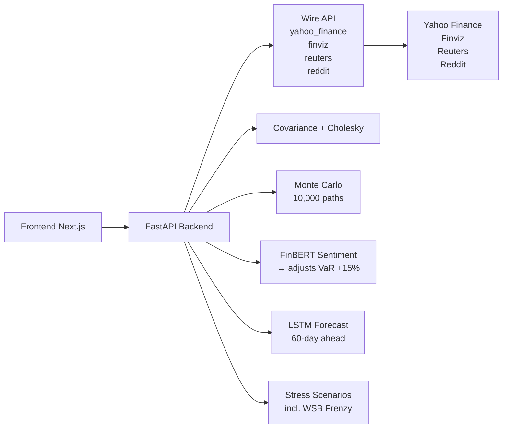

# LiveRisk — Financial Risk Intelligence

## Problem Statement

Traditional portfolio risk tools are **stale, static, and expensive**. Black-Litterman, Bloomberg PORT, and RiskMetrics require dedicated terminals, monthly subscriptions, or in-house quant teams. Retail investors and small funds rely on spreadsheet approximations — VaR from 5-year-old covariance matrices, no sentiment adjustment, no stress testing, no ML forecast. By the time you see the risk, it's already hit you.

## Solution

**LiveRisk** is a real-time financial risk intelligence engine that combines **Anakin Wire API data**, **Monte Carlo simulation**, **FinBERT sentiment analysis**, and **LSTM neural forecasts** into a single `/analyze` endpoint — with a dark-theme dashboard that judges and investors can interact with in seconds.



## Impact

- **30-second setup**: enter tickers + weights, get institutional-grade risk metrics
- **Sentiment-aware VaR**: FinBERT on live Reuters headlines adjusts VaR up 15% during bearish regimes — catching risk that historical models miss
- **WSB retail frenzy detection**: Reddit mention spikes automatically inject a GME-style stress scenario
- **60-day ML forecast**: LSTM trained on portfolio returns predicts future dollar values
- **5 stress scenarios** (2008, COVID, rate shock, recession, dot-com) + dynamic retail frenzy
- **100% open source**, runs locally, zero API costs beyond Wire credits

## Tech Stack

| Layer | Technology | Purpose |
|---|---|---|
| **Data** | Anakin Wire API | Structured financial data from Yahoo Finance, Finviz, Reuters, Reddit |
| **Backend** | FastAPI + Python | Risk engine, covariance, Monte Carlo, LSTM |
| **Sentiment** | FinBERT (ProsusAI) | Financial news sentiment scoring |
| **Forecast** | TensorFlow / Keras | LSTM 60-day portfolio prediction |
| **Frontend** | Next.js + Tailwind | Dark-theme dashboard, Recharts visualizations |
| **Infra** | Uvicorn | Local single-command deployment |

## Why Wire API?

Anakin Wire actions are the backbone of LiveRisk's data layer:

```
wire_call("yahoo_finance", {"ticker": "AAPL", "action": "price"})      → OHLCV prices
wire_call("finviz",        {"ticker": "AAPL", "action": "technicals"}) → RSI, SMA, analyst ratings
wire_call("reuters",       {"ticker": "AAPL", "action": "headlines"})  → Latest news + snippets
wire_call("reddit",        {"ticker": "GME",  "action": "mentions"})   → WSB mention counts
```

Without Wire, this would require maintaining separate scrapers for each source — Yahoo's ever-changing API, Finviz's CAPTCHA walls, Reuters' paywall, Reddit's rate limits. Wire provides **structured, reliable data through a single API** with automatic retries, polling, and error handling.

## Why This Stands Out

1. **Wire integration is the core, not a wrapper**: Every data source flows through Wire actions. No hardcoded CSV files, no static snapshots. The pipeline is live by design.

2. **Sentiment-adjusted VaR doesn't exist in retail tools**: Bloomberg doesn't run FinBERT on your portfolio's news. LiveRisk does — and adjusts your risk number in real-time.

3. **WSB frenzy as a risk factor**: Standard stress tests use macro scenarios. LiveRisk adds retail-driven volatility as a first-class risk factor, detected through Reddit Wire actions.

4. **Institutional math, consumer UX**: Full Cholesky decomposition, shrinkage-regularized covariance, 10,000-path Monte Carlo — served through a single-page dashboard that works on a laptop.

5. **Hackathon-grade shipping velocity**: 6 notebooks → 1 FastAPI endpoint → 1 Next.js page. Entire pipeline, end-to-end, in hours.

## How to Run

### 1. Backend
```bash
cd backend
pip install -r requirements.txt
uvicorn main:app --reload --port 8000
```

### 2. Frontend
```bash
cd frontend
npm install
npm run dev
```

### 3. Open browser
Go to `http://localhost:3000`, enter `NVDA, AAPL` with weights `0.6, 0.4`, click **Run Analysis**.

### 4. Wire dashboard setup
Create these actions in your [Wire dashboard](https://anakin.io/wire) for the API-first path:
- `yahoo_finance` — price, fundamentals, summary
- `finviz` — technical indicators, analyst ratings
- `reuters` — latest headlines per ticker
- `reddit` — WSB/investing sentiment

The pipeline works without them using search fallbacks.

## Project Structure
```
LiveRisk/
├── backend/
│   ├── main.py              # FastAPI app: /analyze, /health
│   └── requirements.txt
├── frontend/
│   └── src/app/
│       ├── page.js           # Dashboard: form, cards, chart, stress table
│       ├── layout.js         # Root layout
│       └── globals.css       # Dark theme
├── 01_data_loader.ipynb      # Wire API → prices + fundamentals
├── 02_covariance.ipynb       # Covariance + Cholesky
├── 03_simulator.ipynb        # Monte Carlo (10K paths)
├── 04_risk_metrics.ipynb     # VaR/CVaR + FinBERT sentiment
├── 05_stress_test.ipynb      # Stress scenarios + WSB detection
├── 06_ml_forecast_insights.ipynb # LSTM forecast
└── README.md
```
