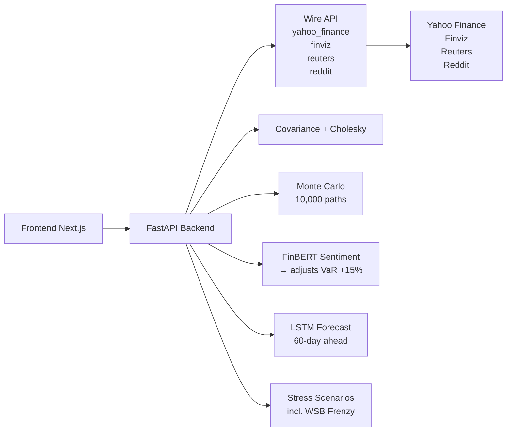

# LiveRisk — Financial Risk Intelligence

## Problem Statement

Traditional portfolio risk tools are **stale, static, and expensive**. Black-Litterman, Bloomberg PORT, and RiskMetrics require dedicated terminals, monthly subscriptions, or in-house quant teams. Retail investors and small funds rely on spreadsheet approximations — VaR from 5-year-old covariance matrices, no sentiment adjustment, no stress testing, no ML forecast. By the time you see the risk, it's already hit you.

## Solution

**LiveRisk** is a real-time financial risk intelligence engine that combines **Anakin Wire API data**, **Monte Carlo simulation**, **FinBERT sentiment analysis**, and **LSTM neural forecasts** into a single `/analyze` endpoint — with a dark-theme dashboard that judges and investors can interact with in seconds.



## Impact

- **30-second setup**: enter tickers + weights, get institutional-grade risk metrics
- **Sentiment-aware VaR**: FinBERT on live Reuters headlines adjusts VaR up 15% during bearish regimes — catching risk that historical models miss
- **WSB retail frenzy detection**: Reddit mention spikes automatically inject a GME-style stress scenario
- **60-day ML forecast**: LSTM trained on portfolio returns predicts future dollar values
- **5 stress scenarios** (2008, COVID, rate shock, recession, dot-com) + dynamic retail frenzy
- **100% open source**, runs locally, zero API costs beyond Wire credits

## Tech Stack

| Layer | Technology | Purpose |
|---|---|---|
| **Data** | Anakin Wire API | Structured financial data from Yahoo Finance, Finviz, Reuters, Reddit |
| **Backend** | FastAPI + Python | Risk engine, covariance, Monte Carlo, LSTM |
| **Sentiment** | FinBERT (ProsusAI) | Financial news sentiment scoring |
| **Forecast** | TensorFlow / Keras | LSTM 60-day portfolio prediction |
| **Frontend** | Next.js + Tailwind | Dark-theme dashboard, Recharts visualizations |
| **Infra** | Uvicorn | Local single-command deployment |

## Why Wire API?

Anakin Wire actions are the backbone of LiveRisk's data layer:

```
wire_call("yahoo_finance", {"ticker": "AAPL", "action": "price"})      → OHLCV prices
wire_call("finviz",        {"ticker": "AAPL", "action": "technicals"}) → RSI, SMA, analyst ratings
wire_call("reuters",       {"ticker": "AAPL", "action": "headlines"})  → Latest news + snippets
wire_call("reddit",        {"ticker": "GME",  "action": "mentions"})   → WSB mention counts
```

Without Wire, this would require maintaining separate scrapers for each source — Yahoo's ever-changing API, Finviz's CAPTCHA walls, Reuters' paywall, Reddit's rate limits. Wire provides **structured, reliable data through a single API** with automatic retries, polling, and error handling.

## Why This Stands Out

1. **Wire integration is the core, not a wrapper**: Every data source flows through Wire actions. No hardcoded CSV files, no static snapshots. The pipeline is live by design.

2. **Sentiment-adjusted VaR doesn't exist in retail tools**: Bloomberg doesn't run FinBERT on your portfolio's news. LiveRisk does — and adjusts your risk number in real-time.

3. **WSB frenzy as a risk factor**: Standard stress tests use macro scenarios. LiveRisk adds retail-driven volatility as a first-class risk factor, detected through Reddit Wire actions.

4. **Institutional math, consumer UX**: Full Cholesky decomposition, shrinkage-regularized covariance, 10,000-path Monte Carlo — served through a single-page dashboard that works on a laptop.

5. **Hackathon-grade shipping velocity**: 6 notebooks → 1 FastAPI endpoint → 1 Next.js page. Entire pipeline, end-to-end, in hours.

## How to Run

### 1. Backend
```bash
cd backend
pip install -r requirements.txt
pip install -r requirements-agent.txt
uvicorn main:app --reload --port 8000
```

### 2. Frontend
```bash
cd frontend
npm install
npm run dev
```

### 3. Open browser
Go to `http://localhost:3000`, enter `NVDA, AAPL` with weights `0.6, 0.4`, click **Run Analysis**.

### 4. Wire dashboard setup
Create these actions in your [Wire dashboard](https://anakin.io/wire) for the API-first path:
- `yahoo_finance` — price, fundamentals, summary
- `finviz` — technical indicators, analyst ratings
- `reuters` — latest headlines per ticker
- `reddit` — WSB/investing sentiment

The pipeline works without them using search fallbacks.

## Vera AI Agent Setup

Vera is a conversational AI portfolio risk analyst powered by LangGraph, LiteLLM, and Celery. It adds natural-language interaction, institutional reports, morning briefs, and threshold alerts to LiveRisk.

### Architecture

```mermaid
flowchart LR
    A[User Chat] --> B[Vera Chat UI]
    B --> C[/api/agent/chat]
    C --> D[LangGraph Agent]
    D --> E[Intent Classifier<br/>gemini-1.5-flash]
    D --> F[Quant Engine<br/>Monte Carlo / VaR / Sentiment]
    D --> G[Forecast Node<br/>claude-sonnet-4-6]
    D --> H[Report Assembler<br/>GPT-4o]
    D --> I[Response Writer<br/>streaming tokens]
    D --> J[Langfuse Tracing]
    D --> K[Memory / Postgres]
    C --> L[StreamingResponse<br/>Server-Sent Events]
    M[Celery Beat] --> N[Morning Brief 6:30AM]
    M --> O[Alert Monitor 15min]
    N --> P[Twilio WhatsApp]
    N --> Q[SendGrid Email]
```

### 1. Install dependencies (two-step to avoid pip resolution conflicts)

```bash
cd backend
pip install -r requirements.txt
pip install -r requirements-agent.txt
```

**Note:** WeasyPrint requires system libraries. On macOS:
```bash
brew install pango libffi
```
On Ubuntu/Debian:
```bash
sudo apt-get install -y libpango-1.0-0 libpangocairo-1.0-0 libgdk-pixbuf2.0-0 libffi-dev libcairo2
```

### 2. Configure environment

```bash
cp .env.example .env
```

Fill in these keys (all optional — Vera degrades gracefully if missing):
- `OPENAI_API_KEY` — GPT-4o for report generation and reasoning
- `ANTHROPIC_API_KEY` — Claude Sonnet for 60-day scenario forecasts
- `GEMINI_API_KEY` — Gemini Flash for intent classification and sentiment
- `LANGFUSE_PUBLIC_KEY` / `LANGFUSE_SECRET_KEY` — LLM tracing (free tier available)
- `TWILIO_ACCOUNT_SID` / `TWILIO_AUTH_TOKEN` — WhatsApp morning briefs
- `SENDGRID_API_KEY` — Email morning briefs with PDF attachment
- `REDIS_URL` — Redis for Celery task queue (default: `redis://localhost:6379/0`)

### 3. Start Redis (required for Celery)

```bash
docker run -d -p 6379:6379 redis:alpine
```

### 4. Start Celery worker

```bash
celery -A backend.tasks.celery_app worker --loglevel=info
```

### 5. Start Celery beat scheduler

```bash
celery -A backend.tasks.celery_app beat --loglevel=info
```

### 6. Start FastAPI

```bash
cd backend
uvicorn main:app --reload --port 8000
```

### 7. Access Vera

Navigate to **http://localhost:3000/vera** in the frontend.

Login first, then click the "Vera AI" tab in the navigation bar.

### Key Features

| Feature | How to Use | Technical Detail |
|---|---|---|
| **Conversational Chat** | Type any question about your portfolio | LangGraph agent with 8 nodes, streaming SSE |
| **60-Day Scenario Analysis** | Click "60-Day Outlook" or ask "what's my forecast" | Claude Sonnet generates bull/base/bear with probabilities |
| **Institutional Risk Report** | Click "Report" tab or ask "generate a report" | GPT-4o assembles full markdown → downloadable PDF |
| **Morning Briefs** | Enable in "Morning Brief" tab | Celery beat sends WhatsApp + email at 6:30 AM daily |
| **Threshold Alerts** | Configure in "Alerts" tab | Celery checks VaR/health/volatility every 15min |
| **Accountability Tracking** | Auto-generated in Morning Brief tab | Tracks recommendation accuracy vs actual market |
| **LLM Cost Tracking** | Automatic | Langfuse traces every LLM call with token counts |
| **Model Fallbacks** | Automatic | GPT-4o → Claude Sonnet → Gemini Flash on failure |

### Graceful Degradation

Vera is designed to work without any external dependencies:

- **No LLM keys**: Falls back to rule-based quant interpretation
- **No Redis**: Celery tasks skip silently, scheduling disabled
- **No Twilio/SendGrid**: Briefs log to database instead of sending
- **No PostgreSQL**: Falls back to SQLite (`liverisk.db`)
- **WeasyPrint not installed**: PDF download falls back to raw markdown

The core quant engine (Monte Carlo, VaR, sentiment) always works regardless of Vera configuration.

## Project Structure
```
LiveRisk/
├── backend/
│   ├── main.py              # FastAPI app: /analyze, /health
│   └── requirements.txt
├── frontend/
│   └── src/app/
│       ├── page.js           # Dashboard: form, cards, chart, stress table
│       ├── layout.js         # Root layout
│       └── globals.css       # Dark theme
├── 01_data_loader.ipynb      # Wire API → prices + fundamentals
├── 02_covariance.ipynb       # Covariance + Cholesky
├── 03_simulator.ipynb        # Monte Carlo (10K paths)
├── 04_risk_metrics.ipynb     # VaR/CVaR + FinBERT sentiment
├── 05_stress_test.ipynb      # Stress scenarios + WSB detection
├── 06_ml_forecast_insights.ipynb # LSTM forecast
├── backend/
│   ├── agent/                   # Vera AI agent
│   │   ├── state.py            # RiskAgentState TypedDict
│   │   ├── vera.py             # LangGraph multi-node agent
│   │   ├── memory.py           # Conversation & risk run persistence
│   │   ├── langfuse_config.py  # LLM tracing & cost tracking
│   │   ├── litellm_config.py   # Multi-model routing with fallbacks
│   │   ├── pdf_generator.py    # weasyprint markdown→PDF
│   │   └── accountability.py   # Tracks recommendation accuracy
│   ├── tasks/                   # Celery scheduled tasks
│   │   ├── celery_app.py       # Redis broker + beat schedule
│   │   ├── morning_brief.py    # 6:30 AM WhatsApp + email briefs
│   │   └── alert_monitor.py    # Threshold-based risk alerts
│   ├── database/                # SQLAlchemy models
│   │   ├── connection.py       # Engine + session factory
│   │   └── models.py           # User, Portfolio, Conversation, etc.
│   └── routes/
│       └── agent.py            # /api/agent/chat, /report, /alerts, etc.
├── frontend/src/
│   ├── components/agent/        # Vera frontend components
│   │   ├── VeraChat.tsx        # Conversational chat interface
│   │   ├── VeraReport.tsx      # Full report viewer with PDF download
│   │   ├── MorningBrief.tsx    # Brief subscription & timeline
│   │   └── AlertConfig.tsx     # Alert threshold sliders
│   └── app/vera/
│       └── page.js             # Vera tab with sub-tabs
└── README.md
```
